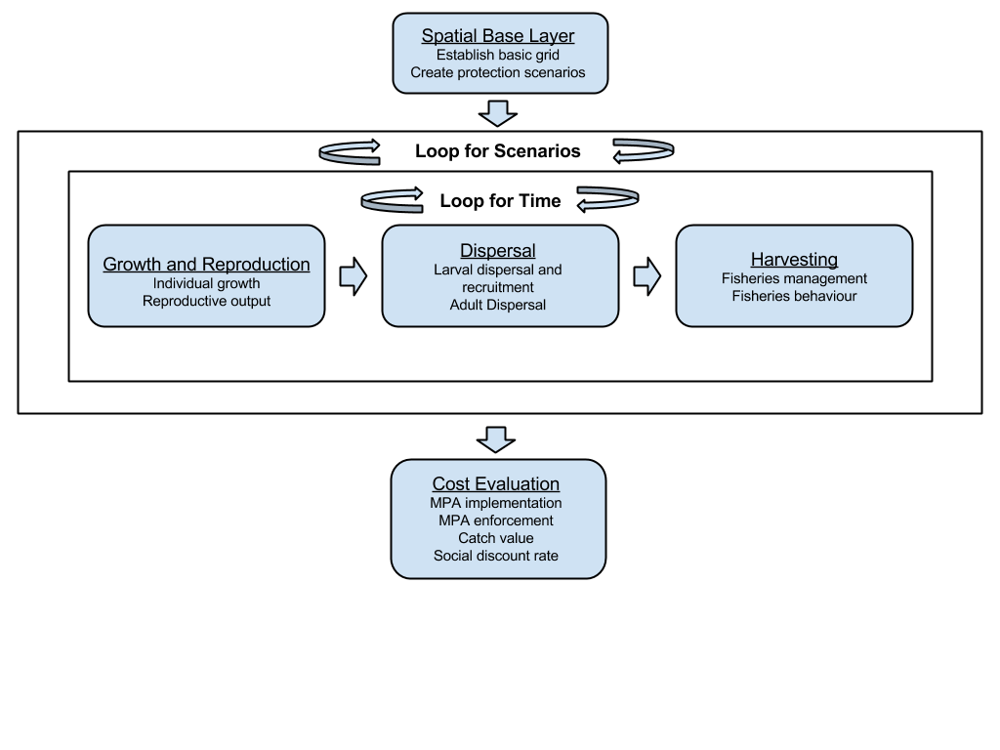

```{r, echo=FALSE, message=FALSE, warning=FALSE}
# load packages
library(rgdal)
library(rgeos)
library(ggplot2)
```

## Everything is open-access
<link rel="stylesheet" href="https://maxcdn.bootstrapcdn.com/font-awesome/4.4.0/css/font-awesome.min.css">
<div class="columns-2">
  <div class="rows-2">
  <center><a href="http://remi-daigle.github.io/bioeconomic_MPA/" style="text-decoration:none" class="fa fa-book fa-5x"></a>
  
  Documentation
  
  <a href="http://f1000research.com/articles/4-1234/v1" style="text-decoration: none" class="fa fa-file-text fa-5x"></a>
  
  Case Study Paper</center>

  <center><a href="https://github.com/remi-daigle/bioeconomic_MPA" style="text-decoration: none" class="fa fa-code fa-5x"></a>

  Code

  <a href="http://figshare.com/articles/Bioeconomic_MPA_network_design_Cod_case_study_output/1585146" style="text-decoration: none" class="fa fa-database fa-5x"></a>

  Data</center>
  </div>
</div>


## The question:
**If MPA networks follow designn protocol X, Y, or Z, does the fishing industry stand to suffer or benefit financially?**

Atlantic cod case study scenarios:

- Status Quo
- Maximum Distance
- Fixed Distance
- Targeted

## Scenario 1: Status Quo {.columns-2}
```{r,echo=FALSE,results='hide',fig.width=4,fig.height=5}
#load shapefiles
proj  <- "+proj=lcc +lat_1=40 +lat_2=70 +lat_0=-71.3 +lon_0=-96 +x_0=0 +y_0=0 +ellps=GRS80 +datum=NAD83 +units=m +no_defs"

eez <- readOGR(dsn=getwd(), layer = "eez_iho_union_v2")
eez <- gUnionCascaded(eez[eez$marregion!="Canadian part of the Davis Strait",])
eez <- spTransform(eez,CRS(proj))

shp <- readOGR(dsn=getwd(), layer = "Status_quo_1")
shp <- spTransform(shp,CRS(proj))

#plot
par(mar=c(0,0,1,0),xpd=TRUE,bg=NA)
plot(eez,lwd=2)
plot(shp,col="purple",add=TRUE,border='purple')
legend('top',fill=c('purple'),legend=c('MPA'),bty = 'n',cex=1.7,inset=-0.08)
```

- only includes currently established MPAs


## Scenario 2: Maximum Distance {.columns-2}
```{r,echo=FALSE,results='hide',fig.width=4,fig.height=5}
#load shapefiles
shp <- readOGR(dsn=getwd(), layer = "MPAs_maxdist_1")
shp <- spTransform(shp,CRS(proj))

#plot
par(mar=c(0,0,1,0),xpd=TRUE,bg=NA)
plot(eez,lwd=2)
plot(shp,col="green",add=TRUE,border='green')
legend('top',fill=c('green'),legend=c('MPA'),bty = 'n',cex=1.7,inset=-0.08)
```

- minimizes population connectivity
- places MPAs as far as possible from nearest neighbours

## Scenario 3: Fixed Distance {.columns-2}
```{r,echo=FALSE,results='hide',fig.width=4,fig.height=5}
#load shapefiles
shp <- readOGR(dsn=getwd(), layer = "MPAs_fixed_1")
shp <- spTransform(shp,CRS(proj))

#plot
par(mar=c(0,0,1,0),xpd=TRUE,bg=NA)
plot(eez,lwd=2)
plot(shp,col="red",add=TRUE,border='red')
legend('top',fill=c('red'),legend=c('MPA'),bty = 'n',cex=1.7,inset=-0.08)
```

- optimizizes population connectivity
- places MPAs at a fixed distance from the nearest neighbours
- the distance is biologically relevant (i.e. dispersal distance)

## Scenario 4: Targeted {.columns-2}
```{r,echo=FALSE,results='hide',fig.width=4,fig.height=5}
#load shapefiles
shp <- readOGR(dsn=getwd(), layer = "MPAs_targeted_1")
shp <- spTransform(shp,CRS(proj))

#plot
par(mar=c(0,0,1,0),xpd=TRUE,bg=NA)
plot(eez,lwd=2)
plot(shp,col="blue",add=TRUE,border='blue')
legend('top',fill=c('blue','yellow'),legend=c('MPA','Breeding'),bty = 'n',cex=1.7,inset=-0.08,ncol = 2)
```

- maximizes biological relevance
- protects "breeding areas" by default
- places remaining MPAs at a fixed distance from the nearest neighbours


## Scenario 4: Targeted {.columns-2}
```{r,echo=FALSE,results='hide',fig.width=4,fig.height=5}
#load shapefiles
shp <- readOGR(dsn=getwd(), layer = "MPAs_targeted_1")
shp <- spTransform(shp,CRS(proj))

cod <- readOGR(dsn=getwd(), layer = "cod_breeding")
cod <- spTransform(cod,CRS(proj))
#plot
par(mar=c(0,0,1,0),xpd=TRUE,bg=NA)
plot(eez,lwd=2)
plot(shp,col="blue",add=TRUE,border='blue')
plot(cod[2:15,],col="yellow",add=TRUE,border='yellow')
legend('top',fill=c('blue','yellow'),legend=c('MPA','Breeding'),bty = 'n',cex=1.7,inset=-0.08,ncol = 2)
```

- maximizes biological relevance
- protects "breeding areas" by default
- places remaining MPAs at a fixed distance from the nearest neighbours

----
<center></center>

## The input: Spatial Base Layer {.columns-2}

Shapefiles:

- EEZ
- Species' habitat
- Species' breeding areas
- Protection scenarios*

*may be generated at this step, or imported

```{r,echo=FALSE,results='hide',fig.width=4,fig.height=5}
#load shapefiles
hab <- readOGR(dsn=getwd(), layer = "cod_habitat")
hab <- gIntersection(spTransform(hab,CRS(proj)),eez,byid = TRUE)
#plot
par(mar=c(0,0,1,0),xpd=TRUE,bg=NA)
plot(eez,lwd=2)
plot(hab,col="blue",add=TRUE,border='blue')
plot(cod[2:15,],col="yellow",add=TRUE,border='yellow')
legend('top',fill=c('blue','yellow'),legend=c('Habitat','Breeding'),bty = 'n',cex=1.7,inset=-0.08,ncol = 2)
```

## The input: Growth and Reproduction {.columns-2}

Von Bertalanffy growth model (Knickle and Rose 2013):

- Asymptotic length
- growth coefficient

Fecundity:

- Length-weight relationship (Knickle and Rose 2013)
- 500000 eggs/kg


## The input: Dispersal {.columns-2}

Von Bertalanffy growth model (Knickle and Rose 2013):

- Asymptotic length
- growth coefficient

Fecundity:

- Length-weight relationship (Knickle and Rose 2013)
- 500000 eggs/kg

## The input: Harvesting {.columns-2}
**Case Study**

*Adult:*

- Based on known migration distances

*Larval:*

- Length-weight relationship (Knickle and Rose 2013)
- 500000 eggs/kg

<div style="color:transparent;">
lack of breaks is so stupid
</div>

**Built-in functionality**

The 'input' here can be connectivity matrices generated by:

- random dispersal (case study) 
- simple biophysical dispersal models (ocean currents)
- complex biophysical dispersal models (larval behaviours)

## The input: Cost Evaluation {.columns-2}
**MPA implementation & enforcement** 

- not in case study

**Catch value:**

- gross landing value
- net = gross - operating costs

**Net Present Value:**

- we do not value things in the future as much as the present 
- effectively the opposite of interest rates

```{r,echo=FALSE,results='hide',fig.width=3.75,fig.height=5}
Year <- c(2000:2050)
Value <- c((1:51)*1000)
ValueSDR006 <- cumsum(1000*1/(1+0.06)^(Year-min(Year)))
par(mar=c(4,4,1,1),xpd=TRUE,bg=NA)
plot(Year,Value,lwd=3,type='l',cex=1.7)
lines(Year,ValueSDR006,lwd=3,col="blue")
legend('top',lty=1,lwd=3,col=c('black','blue'),legend=c('SDR = 0','SDR = 0.06'),bty = 'n')
title("Example: 1000$ per year")
```

## Using the toolbox

[Downloading](https://github.com/remi-daigle/bioeconomic_MPA) the toolbox should allow users to **replicate the findings** presented in the [case study](http://f1000research.com/articles/4-1234/v1).

Users should be able to **substitute their own input** in 'user_input.R' to represent **different areas/species**.

Efforts were made to **modularize the code** so that users can 'easily' edit [modules/sub-modules](http://remi-daigle.github.io/bioeconomic_MPA/)

## Results:
```{r,echo=FALSE,message=FALSE,warning=FALSE,results='hide',fig.width=8,fig.height=5,dev.args = list(bg = 'transparent')}
fish_long <- read.csv("fish_long.csv")
protect_scen_names <- c("Status Quo", "Maximum Distance", "Fixed Distance" , "Targeted")
protect_scen_colour <- c("purple","green","red","blue")
ggplot(fish_long,aes(x=time,y=biomass,colour=scenario))+
    geom_smooth(cex=2)+
    theme_classic()+
    theme(legend.position="top",
          text=element_text(size=18),
          panel.background = element_rect(fill = "transparent",colour = NA),
          plot.background = element_rect(fill = "transparent",colour = NA))+
    labs(x="Year",y="Total Stock Biomass (t)")+
    scale_colour_manual(values=protect_scen_colour,
                        labels=protect_scen_names,name="")
```

## Results:
```{r,echo=FALSE,message=FALSE,warning=FALSE,results='hide',fig.width=8,fig.height=5,dev.args = list(bg = 'transparent')}
fish_value <- read.csv("fish_value.csv")
ggplot(fish_value,aes(x=time,y=tot_catch,colour=scenario))+
    geom_smooth(cex=2)+
    theme_classic()+
    theme(legend.position="top",
          text=element_text(size=18),
          panel.background = element_rect(fill = "transparent",colour = NA),
          plot.background = element_rect(fill = "transparent",colour = NA))+
    labs(x="Year",y="Total catch (t)")+
    scale_colour_manual(values=protect_scen_colour,
                        labels=protect_scen_names,name="")
```

## Results:
```{r,echo=FALSE,message=FALSE,warning=FALSE,results='hide',fig.width=8,fig.height=5,dev.args = list(bg = 'transparent')}
fish_value <- read.csv("fish_value.csv")
ggplot(fish_value,aes(x=time,y=dist,colour=scenario))+
    geom_smooth(cex=2)+
    theme_classic()+
    theme(legend.position="top",
          text=element_text(size=18),
          panel.background = element_rect(fill = "transparent",colour = NA),
          plot.background = element_rect(fill = "transparent",colour = NA))+
    labs(x="Year",y="Mean distance from shore (km)")+
    scale_colour_manual(values=protect_scen_colour,
                        labels=protect_scen_names,name="")
```

## Results:
```{r,echo=FALSE,message=FALSE,warning=FALSE,results='hide',fig.width=8,fig.height=5,dev.args = list(bg = 'transparent')}
fish_value <- read.csv("fish_value.csv")
gathered <- gather(fish_value,SDR,cumsumvalue,net_catch_value_SDRA_cumsum,net_catch_value_SDRB_cumsum,net_catch_value_SDRC_cumsum)
levels(gathered$SDR) <- sub("^net_catch_value_SDRA_cumsum$","SDR = 0.015",levels(gathered$SDR))
levels(gathered$SDR) <- sub("^net_catch_value_SDRB_cumsum$","SDR = 0.03",levels(gathered$SDR))
levels(gathered$SDR) <- sub("^net_catch_value_SDRC_cumsum$","SDR = 0.06",levels(gathered$SDR))
levels(gathered$scenario) <- protect_scen_names

ggplot(gathered %>% filter(SDR=="SDR = 0.06"),aes(x=time,y=cumsumvalue,colour=scenario,xlab="test"))+
        geom_smooth(cex=1.5)+
        theme_classic()+
        scale_colour_manual(values=protect_scen_colour,name="",labels = protect_scen_names)+
        #facet_wrap(~SDR,ncol=1,scale="free_x")+
        theme(strip.background=element_blank(),
              legend.position="none",
              strip.text=element_text(face="bold"),
              text=element_text(size=18))+
        labs(x="Year",y=expression(paste("Cumulative Net Present Value (10"^"6"," CAD)",sep="")))
```