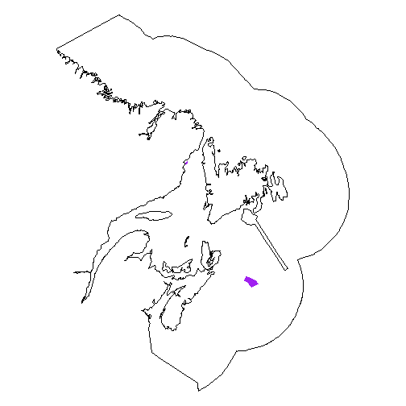
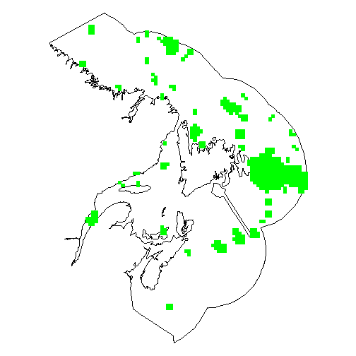
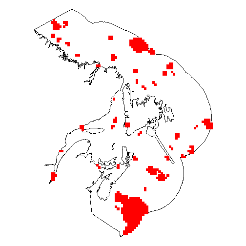

Assessing commercial fishery costs and benefits related to MPA network design
========================================================
author: Remi Daigle

The question:
========================================================

**If MPA networks follow designn protocol X, Y, or Z, does the fishing industry stand to suffer or benefit financially?**

Atlantic cod case study scenarios:
- Status Quo
- Maximum Distance
- Fixed Distance
- Targeted

Scenario 1: Status Quo
========================================================
left:60%
 
***
- only includes currently established MPAs

Scenario 2: Maximum Distance
========================================================
left:60%
 
***
- minimizes population connectivity
- places MPAs as far as possible from nearest neighbours

Scenario 3: Fixed Distance
========================================================
left:60%
 
***
- optimizizes population connectivity
- places MPAs at a fixed distance from the nearest neighbours
- the distance is biologically relevant (i.e. dispersal distance)

Scenario 4: Targeted
========================================================
left:60%
 
***
- maximizes biological relevance
- protects "breeding areas" by default
- places remaining MPAs at a fixed distance from the nearest neighbours

